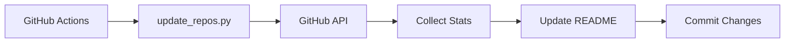

# Solana Projects Tracker - Quick Start Guide

## What This Project Does

This repository automatically maintains a **live, curated list of open-source Solana ecosystem projects**. It's like an self-updating awesome list that:

- 🔍 **Discovers new projects** automatically via GitHub search
- 📊 **Updates statistics** (stars, contributors, activity) in real-time  
- 📝 **Regenerates documentation** with fresh data
- 🤖 **Runs completely automated** via GitHub Actions

## Key Files Explained

| File | Purpose | Description |
|------|---------|-------------|
| **`README.md`** | 📋 Main Documentation | Auto-generated table of Solana projects with live stats |
| **`update_repos.py`** | 🧠 Core Logic | Python script that handles all the automation |
| **`repos.yaml`** | ⚙️ Configuration | Database of tracked repositories and search queries |
| **`demo_update.py`** | 🎮 Demo Script | Try the functionality without a GitHub token |
| **`CODE_EXPLANATION.md`** | 📖 Documentation | Detailed code explanation for developers |
| **`.github/workflows/`** | ⚡ Automation | GitHub Actions that run the updates |

## How It Works (Simple Version)



1. **Every hour**, GitHub Actions triggers the update script
2. **Script fetches** latest stats for all tracked repositories
3. **Searches for** new Solana projects using configured queries
4. **Updates README** with fresh data in a formatted table
5. **Commits changes** automatically back to the repository

## Quick Demo

Try this without any setup:

```bash
git clone https://github.com/lalitcap23/solana_os_project-live-.git
cd solana_os_project-live-
python3 demo_update.py
```

This shows you:
- ✅ How project categorization works
- ✅ Number formatting examples  
- ✅ Current repository statistics
- ✅ Configured search queries

## For Developers

### Want to understand the code?
👉 Read **[CODE_EXPLANATION.md](./CODE_EXPLANATION.md)** - comprehensive technical documentation

### Want to set up your own?
👉 Read **[AUTOMATION_GUIDE.md](./AUTOMATION_GUIDE.md)** - step-by-step setup guide

### Key Technologies Used:
- **Python 3.11** - Core automation logic
- **GitHub API v3** - Data source for repository information
- **YAML** - Configuration and data storage
- **GitHub Actions** - Automated execution and scheduling
- **Markdown** - Documentation generation

## Stats at a Glance

- 📦 **91 repositories** currently tracked
- 🏷️ **8 categories** (Infrastructure, SDKs, DeFi, etc.)
- 🔍 **10 search queries** for discovering new projects
- ⏰ **Hourly updates** via automation
- 🌟 **4.5k+ total stars** across all tracked projects

## Why This Matters

The Solana ecosystem is rapidly evolving with new projects launching constantly. This tracker:

- ✨ **Saves time** - No manual checking of hundreds of repositories
- 📈 **Shows trends** - See which projects are gaining traction  
- 🔍 **Discovers gems** - Find new tools and libraries automatically
- 📊 **Provides insights** - Understand the ecosystem landscape
- 🤝 **Helps developers** - Find the right tools for their projects

---

*This is a community-driven project. Contributions welcome!* ⭐